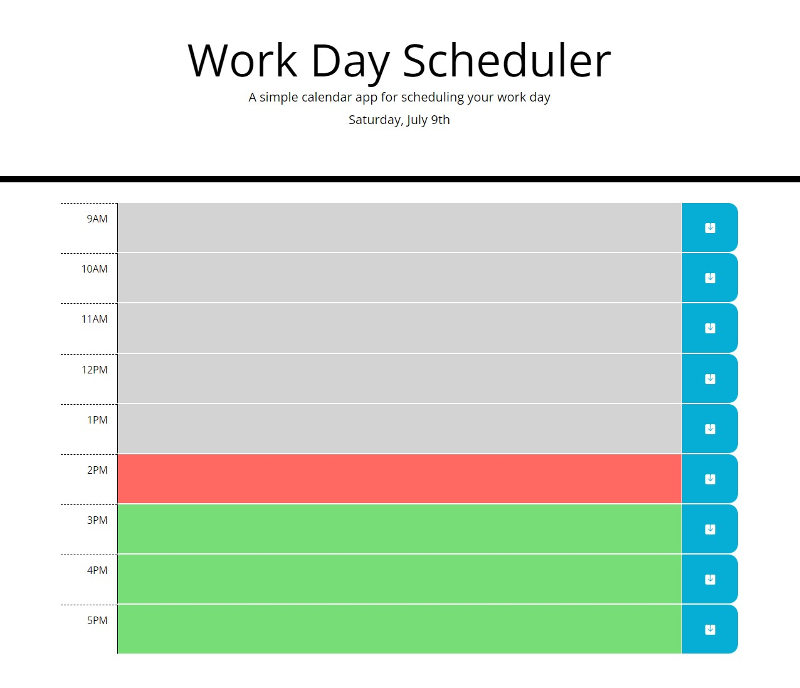
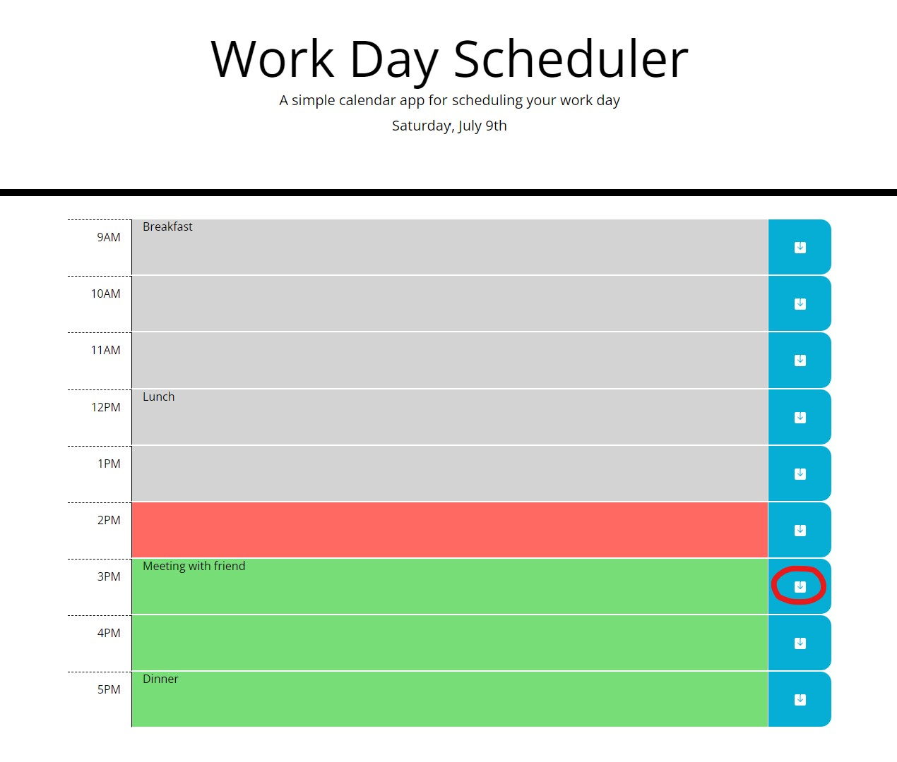

# work-day-scheduler
This is a calendar application that lets the user to plan each hour of their work schedule (9AM to 5PM). They can mark down events for each hour and save them.

## Installation
1. Access the repository on GitHub [here](https://github.com/christylex3/work-day-scheduler).
2. Clone it to your computer.
3. Look for the `work-day-scheduler` directory and then open it.
4. Then launch the `index.html` file to see the website, which should look like [this](https://christylex3.github.io/work-day-scheduler/).

## Usage
1. Enter any event in the timeblocks.
2. Click on the `save button` that follows after the timeblock to save that certain event to that certain timeblock. 
    * *That is, if you have a meeting with a friend at 3PM, click on the save button on the right of that timeblock. (Indicated in figure 2)* 
3. If you do not click on the `save button`, then the event will not be saved, so refreshing the page will remove the event from the schedule.

## Additional Pictures
* **Figure 1**: Latest date is displayed on top below the title. Grey block indicates past hour, red block indicates current hour, and green block indicates future hour.

* **Figure 2**: Each timeblock has their own save button. To save the event at 3PM, click on the `save button` that's circled in red. If you click on the other save buttons not corresponding to the 3PM event, then the 3PM event will not be saved and will be lost if page refreshes or closes.
